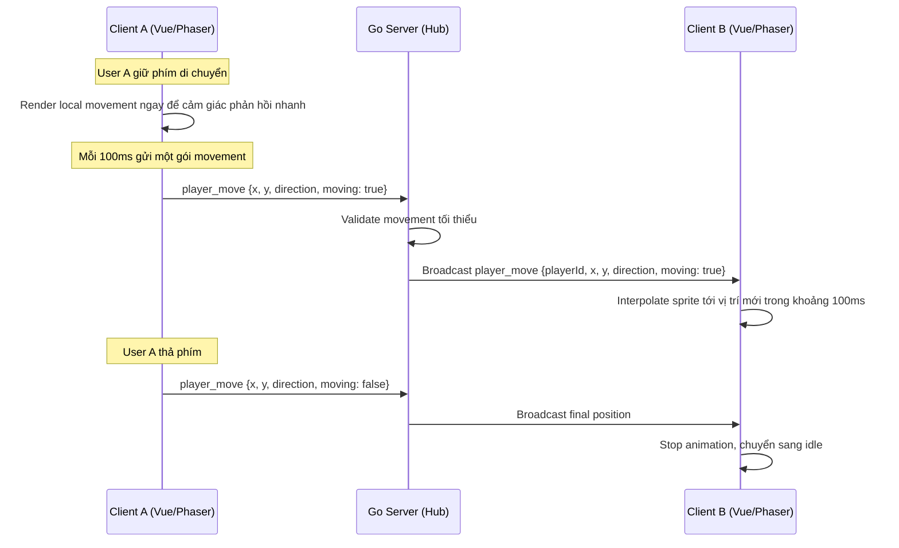

# ĐỀ XUẤT DỰ ÁN: BigTown
**MVP game 2D multiplayer real-time với avatar, combat nhẹ, chat và leaderboard**

---

## 1. Tổng quan dự án (Executive Summary)

**BigTown** là một Web Game 2D nhiều người chơi, nơi người dùng cùng tham gia vào một bản đồ chung, tạo nhân vật từ các asset pixel art có sẵn, di chuyển trong map, gặp nhau, chat trực tiếp trong game, đánh NPC enemy để tích điểm thưởng và dùng điểm/tiền để đổi thêm vật phẩm trang trí cho nhân vật.

Mục tiêu của bản MVP là kiểm chứng phần lõi của sản phẩm: **nhiều người cùng online trong một map 2D, đồng bộ vị trí real-time, có vòng lặp gameplay đơn giản và có dữ liệu người chơi được lưu bền vững**. App sẽ hỗ trợ Teams SSO để người dùng vào từ Microsoft Teams có thể được xác thực tự động; các tính năng Mini-ERP, task management, logtime, AI/ML và tích hợp Teams nâng cao sẽ tạm thời để sau.

---

## 2. Phạm vi MVP

Phiên bản MVP tập trung vào các tính năng sau:

1. **Đăng nhập và hồ sơ người chơi**
   - Người dùng có tài khoản, số tiền/điểm ban đầu và trạng thái nhân vật được lưu trong database.
   - Khi vào game, server trả về thông tin nhân vật, inventory và điểm hiện tại.

2. **Tạo và tuỳ biến nhân vật**
   - Người dùng chọn sprite/body/accessory từ các asset pixel art có sẵn.
   - Mỗi người có một lượng tiền/điểm ban đầu để mua hoặc đổi vật phẩm cơ bản.
   - Các lựa chọn đã mua được lưu vào inventory.

3. **Map 2D multiplayer real-time**
   - Người chơi vào cùng một map, có thể chạy lòng vòng và nhìn thấy nhau.
   - Client gửi vị trí theo tick khoảng **100ms**, không gửi liên tục theo từng frame.
   - Client khác dùng **interpolation** để hiển thị chuyển động mượt hơn giữa các gói tin nhận được.

4. **NPC enemy và điểm thưởng**
   - Enemy NPC được spawn sẵn trong map.
   - Người chơi có thể đánh enemy để nhận điểm thưởng.
   - Điểm thưởng được dùng để đổi thêm item/avatar asset.

5. **Chat trong game**
   - Người chơi gửi tin nhắn qua khung chat.
   - Tin nhắn được broadcast tới các client khác.
   - Tin nhắn mới hiển thị dạng bubble trên đầu nhân vật trong một khoảng thời gian ngắn.

6. **Leaderboard**
   - Hiển thị bảng xếp hạng dựa trên điểm thưởng/tổng điểm.
   - Dữ liệu leaderboard đọc từ database hoặc cache đơn giản tuỳ giai đoạn triển khai.

7. **Âm thanh**
   - Game có nhạc nền và có thể bổ sung sound effect cho các hành động như đánh enemy, nhận điểm, mua item.

---

## 3. Ngoài phạm vi MVP

Các phần sau chưa triển khai trong MVP, chỉ xem là hướng mở rộng:

- Mini-ERP, task management, todo, logtime.
- Tính lương, phân quyền nghiệp vụ phức tạp.
- Teams Tab nâng cao, proximity voice/call.
- AI/ML phân tích cảm xúc hoặc sức khoẻ tổ chức.
- Scale nhiều backend node qua Centrifuge Redis broker.

---

## 4. Tech Stack

### Frontend

- **Framework:** Vue 3, TypeScript, Vite.
- **Game Engine:** Phaser 3 để render map, sprite, animation, camera, collision và game loop.
- **State/UI:** Pinia cho trạng thái app/game cần chia sẻ với Vue UI, Tailwind CSS nếu cần xây UI overlay.
- **Realtime:** `centrifuge-js` client nhận/gửi event gameplay qua room channel.
- **Asset:** Pixel Art, ưu tiên bộ asset có sẵn trong repo như `Cute_Fantasy_Free`.

### Backend

- **Ngôn ngữ:** Golang.
- **HTTP API:** Gin hoặc router tương đương trong boilerplate.
- **Realtime:** `github.com/centrifugal/centrifuge` quản lý WebSocket transport, channel subscription, publish/broadcast và reconnect protocol.
- **Architecture:** Backend chia module theo capability như `realtime`, `leaderboard`, sau này bổ sung `character`, `inventory`, `world` để tránh module game quá rộng.

### Database

- **RDBMS:** PostgreSQL.
- Lưu dữ liệu quan trọng như user, avatar, inventory, wallet/point, enemy kill/reward, leaderboard snapshot nếu cần.
- Dữ liệu tạm thời như vị trí online hiện tại có thể giữ trong RAM của Hub ở bản MVP.

### Nginx

- Nhận request từ client qua **HTTPS/WSS**.
- Terminate TLS tại Nginx.
- Forward vào server Golang qua **HTTP/WS** nội bộ.
- Cấu hình `Upgrade` và `Connection` header để WebSocket hoạt động ổn định.

---

## 5. Deployment View

Luồng triển khai MVP:

```text
Client Browser
  | HTTPS / WSS
  v
Nginx
  - Terminate TLS
  - Serve static frontend hoặc reverse proxy frontend
  - Proxy /api qua HTTP vào Go server
  - Proxy /connection/websocket qua WS vào Go server
  |
  | HTTP / WS nội bộ
  v
Golang Server - 1 node MVP
  - REST API
  - REST API
  - Centrifuge WebSocket endpoint
  - Realtime room channels
  - Gameplay usecases
  |
  v
PostgreSQL
  - User
  - Avatar
  - Inventory
  - Wallet / point
  - Leaderboard data
```

Ở MVP chỉ cần **1 node Golang**. Khi scale nhiều node, Centrifuge có thể dùng Redis broker để đồng bộ publish giữa các node. Runtime room state vẫn nên được bọc sau interface riêng để không phụ thuộc chặt vào RAM.

---

## 6. Backend Component View

Source code backend nên đi theo template Clean Architecture trong `backend_boilerplate`:

### Transport / Infrastructure Layer

- HTTP handlers cho login, avatar, shop, inventory, leaderboard.
- Centrifuge WebSocket endpoint cho gameplay realtime.
- `realtime` module quản lý connection auth, room channel subscription và publish/broadcast.
- Runtime room state sau này nên nằm sau `RoomStore` interface, MVP có thể dùng RAM implementation.
- Repository implementation làm việc với PostgreSQL.

### Usecase Layer

- Không phụ thuộc trực tiếp vào WebSocket hoặc Gin.
- Xử lý nghiệp vụ game:
  - Validate movement.
  - Update avatar selection.
  - Buy/equip item.
  - Calculate reward khi đánh enemy.
  - Update point và leaderboard.
  - Validate chat message trước khi broadcast.

### Domain Layer

- Chứa entity/value object cốt lõi:
  - `Player`
  - `Avatar`
  - `InventoryItem`
  - `Wallet` hoặc `PointBalance`
  - `Enemy`
  - `LeaderboardEntry`
  - `ChatMessage`

---

## 7. Realtime Model

MVP dùng mô hình **client gửi input/vị trí theo tick 100ms**, server nhận, kiểm tra hợp lệ ở mức tối thiểu rồi broadcast cho các client khác.

Các event WebSocket chính:

- `player_joined`: người chơi vào map.
- `player_left`: người chơi rời map.
- `player_move`: cập nhật vị trí/hướng di chuyển.
- `player_chat`: gửi tin nhắn chat.
- `enemy_hit`: người chơi đánh enemy.
- `enemy_killed`: enemy bị hạ, cộng điểm thưởng.
- `player_updated`: avatar, inventory hoặc point thay đổi.
- `leaderboard_updated`: leaderboard thay đổi nếu cần push realtime.

Sequence movement:



Với MVP, vị trí online hiện tại có thể lưu trong RAM của Hub. Database chỉ cần lưu các dữ liệu quan trọng như tài khoản, avatar đang equip, inventory, điểm và lịch sử reward nếu cần audit.

---

## 8. Frontend Organization

Frontend hiện có template `app/shared/features`. Với game MVP, nên giữ hướng **feature-based**, nhưng bên trong feature `game` có thể chia nhỏ theo domain/game system thay vì chia theo screen.

Gợi ý cấu trúc:

```text
src/
  app/
    router/
    layouts/
    providers/
  shared/
    api/
    assets/
    constants/
    types/
    utils/
  features/
    auth/
    avatar/
    shop/
    leaderboard/
    game/
      views/
        GameView.vue
      phaser/
        GameScene.ts
        PreloadScene.ts
        BootScene.ts
      systems/
        movementSystem.ts
        interpolationSystem.ts
        chatBubbleSystem.ts
        enemySystem.ts
      network/
        gameSocket.ts
        gameEvents.ts
      stores/
        gameStore.ts
      components/
        GameCanvas.vue
        ChatPanel.vue
        LeaderboardPanel.vue
```

Lý do không nên chia game theo screen quá sớm:

- MVP chủ yếu là một màn hình lớn: `GameView`.
- Logic game không đi theo page, mà đi theo system: movement, enemy, chat, inventory, interpolation.
- Phaser scene nên được cô lập khỏi Vue component để tránh trộn UI framework với game loop.
- Vue nên lo phần overlay UI như chat panel, leaderboard, shop, avatar builder; Phaser lo render map, sprite, animation và collision.

---

## 9. Data Persistence Gợi Ý

Bảng dữ liệu MVP nên bắt đầu nhỏ:

- `app_user`: hồ sơ user nội bộ.
- `credential`: credential local email/password nếu có.
- `user_identities`: mapping Teams/Microsoft Entra identity với user nội bộ.
- `items`: danh sách asset/item có thể dùng/mua.
- `characters`: thông tin nhân vật, điểm hiện tại, avatar đang equip.
- `player_items`: item/avatar asset người chơi đã sở hữu.
- `npc_types`: cấu hình loại NPC, máu, điểm thưởng.
- `map_npc_spawns`: vị trí spawn NPC trong từng map.
- `reward_events`: lịch sử nhận điểm nếu cần audit.

Leaderboard có thể query trực tiếp từ `characters.score` ở MVP. Khi dữ liệu lớn hơn mới cần cache hoặc snapshot riêng.

---

## 10. Hướng Scale Sau MVP

Khi cần scale nhiều backend node:

- Nginx chuyển từ proxy một node sang load balancing nhiều node.
- Mỗi node chạy Centrifuge node riêng.
- Bổ sung Redis broker cho Centrifuge để đồng bộ publish giữa các node.
- Cân nhắc room ownership để một room realtime chỉ do một node xử lý authoritative state tại một thời điểm.
- Tách state quan trọng khỏi RAM, chỉ giữ realtime ephemeral state trong RAM hoặc sau `RoomStore` interface.
