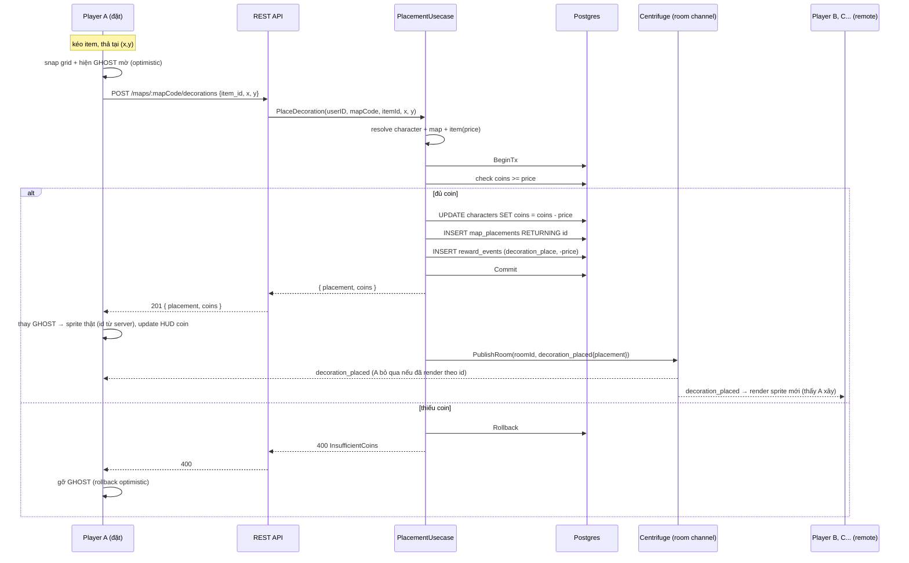
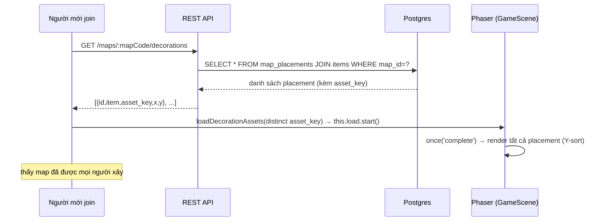

# BigTown — Đặc tả kỹ thuật: Kéo thả asset trang trí map (multiplayer building)

**Feature focus chính trước combat.** Tài liệu này mô tả đầy đủ: quyết định kỹ thuật, mô hình dữ liệu, cách cấp/lưu asset, cơ chế đồng bộ realtime để **mọi người thấy nhau xây nhà**, sequence diagram, các vấn đề cần xử lý, và **skeleton code thật** (backend Go + frontend Vue/Phaser) cho agent khác tham khảo.

> Đặt tại `docs/Feature-Map-Decoration.md`. Pattern bám theo module `chat` (analog gần nhất: HTTP POST → transaction → `PublishRoom` qua Centrifuge) và pattern transaction ở `auth/usecase/register.go`.

---

## 1. Tóm tắt quyết định kỹ thuật

| Vấn đề | Quyết định | Lý do (bám code hiện có) |
|---|---|---|
| Nguồn sự thật của placement | **DB `map_placements`** (bền vững) | Đúng `Storage-Design.md`: DB là nguồn sự thật cho tài sản dài hạn. Không như HP NPC (RAM), placement thay đổi tần suất thấp. |
| Kênh ghi | **HTTP POST (REST)**, KHÔNG cho client publish thẳng | Giống chat: có tiền tham gia → phải validate server-side. Client publish trực tiếp bị chặn (`isRoomChannel` trong `centrifuge.go`). |
| Kênh đồng bộ live | **Broadcast Centrifuge room channel** sau khi TX commit | Tái dùng `RoomPublisher.PublishRoom(ctx, roomID, event)` y hệt `ChatUsecase`. |
| Trừ tiền | **Transaction** (`BeginTx`/`*WithTx`/`Commit`) | Đúng pattern `register.go`. `characters.coins CHECK(coins>=0)` là lưới an toàn chống double-spend. |
| RAM cache placement? | **Không** ở MVP | Placement không nằm trên hot-path (movement). Đọc DB lúc join là đủ. Cache sau nếu cần. |
| Va chạm (có chặn đi lại không?) | **MVP: không chặn** (visual-only), cờ `collides` trong `metadata_json` để sau | Tránh nhốt người chơi + giảm phức tạp. |
| Z-order (đi trước/sau nhà) | **Y-sort**: `depth = y` cho cả decoration lẫn player | Cho cảm giác "đi sau nhà" chân thật; player đã set depth sẵn (`PLAYER_DEPTH`). |
| Ai được xoá | **Chỉ người đặt** (hoặc admin) | Chống griefing trên map chia sẻ. |
| Optimistic UI | **Ghost mờ ngay khi thả**, reconcile theo server ack; rollback nếu thiếu coin | Giống optimistic movement — phản hồi tức thì, sự thật theo server. |
| Snap | **Snap theo `TILE_SIZE`** (16px) | Đồng nhất grid với `mapSystem.ts`. |
| Phạm vi map | Placement **scoped theo `map_id`** | Mỗi map có bộ trang trí riêng; đổi map load bộ khác. |

**Nguyên tắc bất biến:** *số* (giá, coin, quyền) do server quyết trong transaction; *hình* (ghost preview) client render optimistic; đồng bộ nhiều người qua broadcast sau commit.

---

## 2. Cung cấp & lưu trữ asset (hình ảnh)

### 2.1 Định dạng & vị trí
- **Định dạng:** PNG pixel-art, nền trong suốt (đồng nhất `pixelArt: true` trong `createGame.ts`).
- **Vị trí file:** `frontend/public/assets/decorations/` (song song với `assets/tiles/`, `assets/maps/`).
- **Quy ước `asset_key`:** đường dẫn tương đối tính từ `/assets/`, ví dụ `decorations/house_blue.png` (giống `maps.tilemap_asset_key = 'maps/...'`, `tileset = 'tiles/...'`).

### 2.2 Định nghĩa asset trong DB (`items`)
Bảng `items` đã có sẵn cột cần thiết (`code, name, type, asset_key, price, metadata_json`). Mỗi asset trang trí = 1 row `type='decoration'`:

```sql
-- seed.sql: thêm các item trang trí (idempotent: dùng ON CONFLICT (code) DO NOTHING)
INSERT INTO items (code, name, type, asset_key, price, metadata_json) VALUES
('deco_house_blue','Nhà gỗ xanh','decoration','decorations/house_blue.png',500,
   '{"w":64,"h":80,"anchorX":0.5,"anchorY":1.0,"collides":false}'),
('deco_oak_tree','Cây sồi','decoration','decorations/oak_tree.png',120,
   '{"w":32,"h":48,"anchorX":0.5,"anchorY":1.0,"collides":false}'),
('deco_fence','Hàng rào','decoration','decorations/fence.png',30,
   '{"w":16,"h":16,"anchorX":0.5,"anchorY":1.0,"collides":false}')
ON CONFLICT (code) DO NOTHING;
```

`metadata_json` mang **footprint + anchor** để đặt đúng:
- `w`,`h`: kích thước sprite (px) — phục vụ preview + Y-sort.
- `anchorX`,`anchorY`: điểm neo (mặc định `0.5, 1.0` = đáy-giữa, để "chân" nhà chạm đất, Y-sort theo đáy).
- `collides`: MVP để `false` (không chặn di chuyển).

### 2.3 Nạp sprite vào Phaser (động)
Sprite trang trí **không** biết trước lúc build game (phụ thuộc item nào tồn tại + placement nào đã có). Nạp **động** bằng `this.load.image(key, '/assets/'+asset_key)` rồi `this.load.start()`, giống cách `GameScene.preloadMapAssets()` đang nạp tileset động. Gom danh sách `asset_key` distinct từ (a) palette item + (b) placement hiện có, nạp 1 lượt, `once('complete')` mới render.

---

## 3. Mô hình dữ liệu

### 3.1 Bảng mới `map_placements`
```sql
-- schema.sql (create-only) + ghi chú ALTER cho DB đang chạy (mục 8)
CREATE TABLE map_placements (
    id           UUID PRIMARY KEY DEFAULT gen_random_uuid(),
    map_id       UUID NOT NULL REFERENCES maps(id) ON DELETE CASCADE,
    character_id UUID NOT NULL REFERENCES characters(id) ON DELETE CASCADE,  -- ai đặt (để check quyền xoá)
    item_id      UUID NOT NULL REFERENCES items(id) ON DELETE RESTRICT,
    x            INTEGER NOT NULL,   -- world px (đã snap grid), anchor đáy-giữa
    y            INTEGER NOT NULL,
    created_at   TIMESTAMP DEFAULT CURRENT_TIMESTAMP
);
CREATE INDEX idx_map_placements_map_id ON map_placements(map_id);
```
**Quyết định:** *không* đặt `UNIQUE(map_id,x,y)` ở MVP để cho phép chồng lớp (thảm dưới bàn). Nếu muốn chống spam cùng ô, thêm unique sau. Ghi trade-off vào PR.

### 3.2 Reuse `reward_events`
Ghi mỗi lần chi tiêu để truy vết (đúng `Storage-Design.md` 3.11):
```sql
INSERT INTO reward_events (character_id, event_type, coin_delta, metadata_json)
VALUES ($1, 'decoration_place', -$price, $meta);
```

---

## 4. Cơ chế đồng bộ realtime — "mọi người thấy nhau xây nhà"

**Mô hình: shared, persistent, server-authoritative.** Ba luồng:

**A) Đặt (live):**
1. Player A kéo item, thả tại (x,y) → **ghost sprite mờ** hiện ngay trên màn A (optimistic).
2. A gọi `POST /api/maps/:mapCode/decorations { item_id, x, y }`.
3. Server **transaction**: check `coins >= price` → trừ coin → `INSERT map_placements` → `INSERT reward_events` → commit. Trả `{ placement, coins }`.
4. Server **broadcast** `decoration_placed` lên **room channel** (`room:<roomId>`) → **tất cả** client trong map (kể cả A) nhận.
5. A thay ghost bằng sprite thật (reconcile theo id server); B, C… render sprite mới → **thấy A vừa xây**.

**B) Join (thấy map đã xây sẵn):**
- Người mới vào gọi `GET /api/maps/:mapCode/decorations` (hoặc nhét sẵn vào bootstrap) → nhận toàn bộ placement → nạp asset động → render → thấy map hoàn chỉnh như mọi người khác.

**C) Xoá:**
- `DELETE /api/maps/:mapCode/decorations/:placementId` → TX check quyền (chỉ người đặt) → xoá (+ refund tùy policy) → broadcast `decoration_removed { placementId }` → mọi client gỡ sprite.

**Vì sao HTTP + broadcast (không phải client publish thẳng):** đồng nhất với chat — có tiền + cần bền vững + không tin client. Client chỉ *subscribe* room channel để nhận, không được publish (đã bị `centrifuge.go` chặn cho room channel).

---

## 5. Sequence diagram

### 5.1 Đặt trang trí (place + broadcast)


### 5.2 Join — nạp map đã xây


---

## 6. Các vấn đề cần xử lý (kèm quyết định)

1. **Double-spend / race coin:** hai request trừ coin đồng thời → dùng **transaction + `UPDATE ... WHERE coins >= price`** (điều kiện trong chính câu UPDATE) và `CHECK(coins>=0)`. Nếu `RowsAffected=0` → thiếu coin → rollback → 400.
2. **Optimistic rollback:** thiếu coin/lỗi mạng → gỡ ghost. Ghost gắn `tempId`; khi server ack, map `tempId→realId`.
3. **Snap & đổi toạ độ:** screen → world qua `camera.getWorldPoint(pointer)` → snap `Math.round(v/TILE)*TILE`. Lưu world px (anchor đáy-giữa).
4. **Z-order (đi trước/sau nhà):** `sprite.setDepth(y)` cho decoration; player cũng nên set depth theo y để Y-sort đúng (hiện player fix `PLAYER_DEPTH=3` — nâng lên Y-sort, hoặc đặt decoration depth = `y` và player depth = `y` cùng hệ quy chiếu; aboveLayer vẫn depth 10 nằm trên cùng).
5. **Va chạm:** MVP `collides=false`. Nếu bật sau: thêm placement có `collides` vào `collisionGroup` (như `buildCollisionFromObjectLayer`).
6. **Quyền xoá / griefing (map chia sẻ):** chỉ `character_id` người đặt được xoá (check trong TX). Cân nhắc rate-limit + phí đặt để hạn chế spam.
7. **Nạp asset động:** placement/palette tham chiếu sprite chưa preload → gom `asset_key` distinct, `this.load.image` + `start` + `once('complete')` mới render (tránh sprite trống).
8. **Nhất quán khi đổi map:** placement scoped `map_id`; `switchToMap`/`startWarp` phải clear placement cũ + load bộ mới (giống cách destroy remote players).
9. **Đồng bộ trễ / mất gói:** broadcast là "fire-and-forget"; nếu client miss `decoration_placed`, lần join/refresh sau `GET list` sẽ tự đồng bộ (DB là nguồn sự thật). Không cần ack phức tạp ở MVP.
10. **Chồng lớp cùng ô:** cho phép (không unique). Nếu gây rối thị giác, thêm nút "undo last" (xoá placement mới nhất của mình).
11. **Bảo mật giá:** client **không** gửi price; server đọc `items.price`. Client gửi `item_id`,`x`,`y`.
12. **Editor mode vs play mode:** khi ở editor (kéo thả), nên khóa di chuyển nhân vật (tái dùng cờ `chatFocused`-style → `editorActive`) để chuột kéo-thả không lẫn với điều khiển.

---

## 7. Skeleton code (tham khảo cho agent)

> Đây là **khung** để agent điền chi tiết, đã bám đúng pattern module `chat`. Tên package/khớp cấu trúc `backend/internal/module/<name>/{entity,port,repository,usecase,delivery}` + `module.go/provider.go/routes.go`.

### 7.1 Backend — module `placement`

**`entity/placement.go`**
```go
package entity

import "time"

type Placement struct {
    ID          string
    MapID       string
    CharacterID string
    ItemID      string
    // Snapshot item để FE render ngay (join/broadcast) mà không phải join thêm:
    ItemCode    string
    AssetKey    string
    X           int
    Y           int
    CreatedAt   time.Time
}
```

**`port/ports.go`**
```go
package port

import (
    "context"
    "database/sql"

    characterentity "backend/internal/module/character/entity"
    "backend/internal/module/placement/entity"
)

// RoomPublisher: tái dùng CentrifugeTransport (realtimeModule.Transport()) y như chat.
type RoomPublisher interface {
    PublishRoom(ctx context.Context, roomID string, event any) error
}

// CharacterReader: cross-module nhỏ giống chat — lấy character của user (id, coins).
type CharacterReader interface {
    GetByUserID(ctx context.Context, userID string) (*characterentity.Character, error)
}

// MapReader: resolve mapCode -> map_id (+ roomID để broadcast).
type MapReader interface {
    GetByCode(ctx context.Context, code string) (mapID string, roomID string, err error)
}

// ItemReader: lấy giá + asset_key của item.
type ItemReader interface {
    GetByID(ctx context.Context, itemID string) (code, assetKey string, price int, err error)
}

type PlacementRepository interface {
    ListByMap(ctx context.Context, mapID string) ([]entity.Placement, error)
    // Đặt: transaction trừ coin + insert placement + insert reward_events (atomic).
    PlaceTx(ctx context.Context, db *sql.DB, in PlaceParams) (*entity.Placement, int, error) // trả placement + coins mới
    // Xoá: check quyền (character_id) trong TX; trả refund (nếu policy) + ok.
    DeleteTx(ctx context.Context, db *sql.DB, placementID, characterID string) (deleted bool, err error)
}

type PlaceParams struct {
    MapID, CharacterID, ItemID, ItemCode, AssetKey string
    X, Y, Price int
}
```

**`repository/placement_repository.go`** (transaction là trọng tâm — chống double-spend)
```go
package repository

import (
    "context"
    "database/sql"

    "backend/internal/module/placement/entity"
    "backend/internal/module/placement/port"
)

var _ port.PlacementRepository = (*PlacementRepository)(nil)

type PlacementRepository struct{ db *sql.DB }

func NewPlacementRepository(db *sql.DB) *PlacementRepository { return &PlacementRepository{db: db} }

func (r *PlacementRepository) ListByMap(ctx context.Context, mapID string) ([]entity.Placement, error) {
    rows, err := r.db.QueryContext(ctx, `
        SELECT mp.id::text, mp.map_id::text, mp.character_id::text, mp.item_id::text,
               i.code, i.asset_key, mp.x, mp.y, mp.created_at
        FROM map_placements mp
        JOIN items i ON i.id = mp.item_id
        WHERE mp.map_id = $1
        ORDER BY mp.y ASC, mp.created_at ASC
    `, mapID)
    if err != nil { return nil, err }
    defer rows.Close()

    out := []entity.Placement{}
    for rows.Next() {
        var p entity.Placement
        if err := rows.Scan(&p.ID, &p.MapID, &p.CharacterID, &p.ItemID,
            &p.ItemCode, &p.AssetKey, &p.X, &p.Y, &p.CreatedAt); err != nil {
            return nil, err
        }
        out = append(out, p)
    }
    return out, rows.Err()
}

// PlaceTx: BeginTx/Rollback/Commit thủ công theo pattern auth/register.go.
func (r *PlacementRepository) PlaceTx(ctx context.Context, db *sql.DB, in port.PlaceParams) (*entity.Placement, int, error) {
    tx, err := db.BeginTx(ctx, nil)
    if err != nil { return nil, 0, err }
    defer tx.Rollback()

    // 1) Trừ coin CÓ ĐIỀU KIỆN trong chính câu UPDATE => chống double-spend + tôn trọng CHECK(coins>=0).
    var coins int
    err = tx.QueryRowContext(ctx, `
        UPDATE characters SET coins = coins - $2, updated_at = CURRENT_TIMESTAMP
        WHERE id = $1 AND coins >= $2
        RETURNING coins
    `, in.CharacterID, in.Price).Scan(&coins)
    if err == sql.ErrNoRows {
        return nil, 0, ErrInsufficientCoins // -> usecase map sang apperror.BadRequest
    }
    if err != nil { return nil, 0, err }

    // 2) Insert placement.
    var p entity.Placement
    err = tx.QueryRowContext(ctx, `
        INSERT INTO map_placements (map_id, character_id, item_id, x, y)
        VALUES ($1, $2, $3, $4, $5)
        RETURNING id::text, created_at
    `, in.MapID, in.CharacterID, in.ItemID, in.X, in.Y).Scan(&p.ID, &p.CreatedAt)
    if err != nil { return nil, 0, err }

    // 3) Ghi reward_events (audit chi tiêu).
    if _, err = tx.ExecContext(ctx, `
        INSERT INTO reward_events (character_id, event_type, coin_delta)
        VALUES ($1, 'decoration_place', -$2)
    `, in.CharacterID, in.Price); err != nil {
        return nil, 0, err
    }

    if err := tx.Commit(); err != nil { return nil, 0, err }

    p.MapID, p.CharacterID, p.ItemID = in.MapID, in.CharacterID, in.ItemID
    p.ItemCode, p.AssetKey, p.X, p.Y = in.ItemCode, in.AssetKey, in.X, in.Y
    return &p, coins, nil
}

func (r *PlacementRepository) DeleteTx(ctx context.Context, db *sql.DB, placementID, characterID string) (bool, error) {
    // DELETE ... WHERE id=$1 AND character_id=$2  => chỉ chủ sở hữu xoá được.
    res, err := db.ExecContext(ctx, `
        DELETE FROM map_placements WHERE id = $1 AND character_id = $2
    `, placementID, characterID)
    if err != nil { return false, err }
    n, _ := res.RowsAffected()
    return n > 0, nil
    // (Nếu có refund: chuyển sang BeginTx + cộng coin lại trong cùng TX.)
}
```

**`usecase/placement_usecase.go`**
```go
package usecase

import (
    "context"
    "database/sql"

    "backend/internal/apperror"
    "backend/internal/module/placement/entity"
    "backend/internal/module/placement/port"
    "backend/internal/module/placement/repository"
)

type PlacementUsecase struct {
    db         *sql.DB
    repo       port.PlacementRepository
    publisher  port.RoomPublisher
    characters port.CharacterReader
    maps       port.MapReader
    items      port.ItemReader
}

func NewPlacementUsecase(db *sql.DB, repo port.PlacementRepository, pub port.RoomPublisher,
    ch port.CharacterReader, m port.MapReader, it port.ItemReader) *PlacementUsecase {
    return &PlacementUsecase{db: db, repo: repo, publisher: pub, characters: ch, maps: m, items: it}
}

type PlaceInput struct{ UserID, MapCode, ItemID string; X, Y int }

// Event broadcast — shape thống nhất với chat (Type + payload).
type DecorationPlacedEvent struct {
    Type      string `json:"type"` // "decoration_placed"
    ID        string `json:"id"`
    ItemCode  string `json:"itemCode"`
    AssetKey  string `json:"assetKey"`
    X         int    `json:"x"`
    Y         int    `json:"y"`
    PlacedBy  string `json:"placedBy"` // characterId (để FE biết ai xây)
}

func (u *PlacementUsecase) Place(ctx context.Context, in PlaceInput) (*entity.Placement, int, error) {
    ch, err := u.characters.GetByUserID(ctx, in.UserID)
    if err != nil { return nil, 0, err }

    mapID, roomID, err := u.maps.GetByCode(ctx, in.MapCode)
    if err != nil { return nil, 0, apperror.BadRequest("Map không tồn tại", err) }

    code, assetKey, price, err := u.items.GetByID(ctx, in.ItemID)
    if err != nil { return nil, 0, apperror.BadRequest("Item không tồn tại", err) }

    // (validate x,y trong biên map ở đây nếu cần — dùng map width/height)

    placement, coins, err := u.repo.PlaceTx(ctx, u.db, port.PlaceParams{
        MapID: mapID, CharacterID: ch.ID, ItemID: in.ItemID,
        ItemCode: code, AssetKey: assetKey, X: in.X, Y: in.Y, Price: price,
    })
    if err == repository.ErrInsufficientCoins {
        return nil, 0, apperror.BadRequest("Không đủ coin", nil)
    }
    if err != nil { return nil, 0, apperror.Internal(err) }

    // Broadcast SAU commit — mọi client trong room render sprite mới (thấy nhau xây).
    _ = u.publisher.PublishRoom(ctx, roomID, DecorationPlacedEvent{
        Type: "decoration_placed", ID: placement.ID, ItemCode: code,
        AssetKey: assetKey, X: in.X, Y: in.Y, PlacedBy: ch.ID,
    })
    return placement, coins, nil
}

func (u *PlacementUsecase) List(ctx context.Context, mapCode string) ([]entity.Placement, error) {
    mapID, _, err := u.maps.GetByCode(ctx, mapCode)
    if err != nil { return nil, apperror.BadRequest("Map không tồn tại", err) }
    ps, err := u.repo.ListByMap(ctx, mapID)
    if err != nil { return nil, apperror.Internal(err) }
    return ps, nil
}

// Remove: tương tự — DeleteTx theo quyền, rồi broadcast decoration_removed{placementId}.
```

**`delivery/handler.go`** (lấy `user_id` từ context như chat)
```go
func (h *PlacementHandler) Place(ctx *gin.Context) {
    var body struct{ ItemID string `json:"item_id"`; X int `json:"x"`; Y int `json:"y"` }
    if err := ctx.ShouldBindJSON(&body); err != nil {
        ctx.Error(apperror.BadRequest("Dữ liệu không hợp lệ", err)); return
    }
    uid, ok := ctx.Get("user_id")
    if !ok { ctx.Error(apperror.Unauthorized("Thiếu user_id", nil)); return }

    p, coins, err := h.usecase.Place(ctx.Request.Context(), usecase.PlaceInput{
        UserID: uid.(string), MapCode: ctx.Param("mapCode"),
        ItemID: body.ItemID, X: body.X, Y: body.Y,
    })
    if err != nil { ctx.Error(err); return }

    ctx.JSON(http.StatusCreated, gin.H{"success": true, "data": gin.H{
        "placement": p, "coins": coins,
    }})
}
```

**`routes.go`** (mirror chat)
```go
func RegisterRoutes(r *gin.RouterGroup, h *delivery.PlacementHandler) {
    g := r.Group("/maps/:mapCode/decorations")
    g.GET("", h.List)
    g.POST("", h.Place)
    g.DELETE("/:placementId", h.Remove)
}
func (m *PlacementModule) RegisterProtectedRoutes(r *gin.RouterGroup) { RegisterRoutes(r, m.provider.Handler()) }
```

**Wiring `app.go`** (giống dòng tạo `chatModule`)
```go
placementModule := placement.NewPlacementModule(
    a.container.DB,
    realtimeModule.Transport(),        // RoomPublisher
    characterModule.Usecase(),         // CharacterReader + MapReader (đã thỏa 2 interface)
    // ItemReader: dùng characterModule.Usecase() nếu mở rộng, hoặc module item riêng
)
placementModule.RegisterProtectedRoutes(api)
```
> Ghi chú: `characterModule.Usecase()` hiện đã thỏa `MapReader`(GetDefaultMap)/`CharacterResolver`(GetByUserID) cho realtime. Cần bổ sung `GetByCode(code)->(mapID,roomID)` và một `ItemReader` (module `item` mới hoặc thêm method). Đây là phần agent điền.

---

### 7.2 Frontend — Vue + Phaser

**`features/game/services/decoration.service.ts`**
```ts
import { http } from '@/shared/api/http'

export type PlacementDto = {
  id: string; itemCode: string; assetKey: string; x: number; y: number; placedBy?: string
}

export async function listDecorations(mapCode: string): Promise<PlacementDto[]> {
  const res = await http.get(`/maps/${mapCode}/decorations`)
  return res.data.data
}
export async function placeDecoration(mapCode: string, itemId: string, x: number, y: number) {
  const res = await http.post(`/maps/${mapCode}/decorations`, { item_id: itemId, x, y })
  return res.data.data as { placement: PlacementDto; coins: number }
}
export async function removeDecoration(mapCode: string, placementId: string) {
  await http.delete(`/maps/${mapCode}/decorations/${placementId}`)
}
```

**`features/game/systems/placementSystem.ts`** (render + Y-sort + ghost)
```ts
import type Phaser from 'phaser'
import { TILE_SIZE } from './mapSystem'

export type PlacementView = { id: string; sprite: Phaser.GameObjects.Image }

export class PlacementSystem {
  private readonly views = new Map<string, PlacementView>()
  constructor(private readonly scene: Phaser.Scene) {}

  // Snap tọa độ world về grid (anchor đáy-giữa).
  static snap(x: number, y: number) {
    return { x: Math.round(x / TILE_SIZE) * TILE_SIZE, y: Math.round(y / TILE_SIZE) * TILE_SIZE }
  }

  // Render 1 placement (từ list join hoặc event decoration_placed).
  render(p: { id: string; assetKey: string; x: number; y: number }) {
    if (this.views.has(p.id)) return
    const key = 'deco:' + p.assetKey
    const img = this.scene.add.image(p.x, p.y, key).setOrigin(0.5, 1)
    img.setDepth(p.y) // Y-sort: vật ở dưới (y lớn) đè lên vật/nhân vật ở trên
    this.views.set(p.id, { id: p.id, sprite: img })
  }

  remove(id: string) {
    const v = this.views.get(id)
    if (v) { v.sprite.destroy(); this.views.delete(id) }
  }

  // Ghost mờ khi kéo-thả (optimistic), trả về object để hủy nếu server từ chối.
  ghost(assetKey: string, x: number, y: number) {
    const g = this.scene.add.image(x, y, 'deco:' + assetKey).setOrigin(0.5, 1).setAlpha(0.5).setDepth(y)
    return g
  }

  clearAll() { for (const v of this.views.values()) v.sprite.destroy(); this.views.clear() }
}

// Nạp asset động cho các assetKey chưa có texture, resolve khi load xong.
export function loadDecorationAssets(scene: Phaser.Scene, assetKeys: string[]): Promise<void> {
  const missing = assetKeys.filter(k => !scene.textures.exists('deco:' + k))
  if (missing.length === 0) return Promise.resolve()
  return new Promise(resolve => {
    for (const k of missing) scene.load.image('deco:' + k, '/assets/' + k)
    scene.load.once('complete', () => resolve())
    scene.load.start()
  })
}
```

**Wiring trong `GameScene`** (nghe event + nạp ban đầu)
```ts
// trong create(): sau khi buildMap
this.placements = new PlacementSystem(this)
// 1) nạp trang trí đã có của map
listDecorations(mapCode).then(async list => {
  await loadDecorationAssets(this, [...new Set(list.map(p => p.assetKey))])
  list.forEach(p => this.placements.render(p))
})
// 2) event realtime (thêm handler vào gameSocket/gameEvents)
onDecorationPlaced: async (e) => {
  await loadDecorationAssets(this, [e.assetKey])
  this.placements.render({ id: e.id, assetKey: e.assetKey, x: e.x, y: e.y })
},
onDecorationRemoved: (e) => this.placements.remove(e.placementId),
// nhớ clearAll() + load lại khi switchToMap/startWarp (giống destroy remote players)
```

**Drag-drop → world → đặt** (trong editor overlay của `GameCanvas.vue`/`EditorView`)
```ts
// dragstart trên palette item: e.dataTransfer.setData('itemId', item.id); giữ assetKey/price
// trên vùng canvas:
canvasEl.addEventListener('dragover', e => e.preventDefault())
canvasEl.addEventListener('drop', async (e) => {
  e.preventDefault()
  const itemId = e.dataTransfer!.getData('itemId')
  // đổi tọa độ màn hình -> world qua camera của scene
  const cam = scene.cameras.main
  const world = cam.getWorldPoint(e.offsetX, e.offsetY)
  const { x, y } = PlacementSystem.snap(world.x, world.y)

  const ghost = scene.placements.ghost(assetKey, x, y) // optimistic
  try {
    const { placement, coins } = await placeDecoration(mapCode, itemId, x, y)
    editorStore.coins = coins                // cập nhật HUD
    ghost.destroy()
    // sprite thật sẽ tới qua broadcast decoration_placed (hoặc render ngay theo placement.id)
    scene.placements.render(placement)
  } catch (err) {
    ghost.destroy()                          // rollback optimistic (thiếu coin/lỗi)
    editorStore.error = 'Không đủ coin hoặc lỗi khi đặt'
  }
})
```

**`features/game/editor/stores/editor.store.ts`** (Pinia — trạng thái editor)
```ts
import { defineStore } from 'pinia'
export const useEditorStore = defineStore('editor', {
  state: () => ({ active: false, coins: 0, selectedItemId: '' as string, error: '' }),
  actions: {
    toggle() { this.active = !this.active },       // bật editor => khóa di chuyển (như chatFocused)
  },
})
```

**`DecorationPalette.vue`** (nguồn kéo — disable nếu thiếu coin)
```vue
<template>
  <div class="palette" v-if="editor.active">
    <div v-for="it in items" :key="it.id"
         class="palette-item" :class="{ disabled: editor.coins < it.price }"
         draggable="true" @dragstart="onDrag($event, it)">
       <span>{{ it.name }} — {{ it.price }}🪙</span>
    </div>
  </div>
</template>
<script setup lang="ts">
// items lấy từ GET /api/items?type=decoration (endpoint item — agent bổ sung)
function onDrag(e: DragEvent, it) {
  if (editor.coins < it.price) return e.preventDefault()
  e.dataTransfer!.setData('itemId', it.id)
}
</script>
```

**Thêm event types** (`network/gameEvents.ts`)
```ts
export type DecorationPlacedEvent = { type: 'decoration_placed'; id: string; itemCode: string; assetKey: string; x: number; y: number; placedBy: string }
export type DecorationRemovedEvent = { type: 'decoration_removed'; placementId: string }
// -> thêm nhánh switch trong gameSocket.ts để gọi onDecorationPlaced/onDecorationRemoved
```

---

### 7.3 Backend — module `item` + adapter `MapReader.GetByCode` (phần còn thiếu)

Placement usecase phụ thuộc 2 thứ chưa có sẵn: `ItemReader` (giá + asset_key + list palette) và `MapReader.GetByCode` (mapID + roomID). Tin tốt sau khi soi code:

- **roomID CHÍNH LÀ mapCode.** `RealtimeUsecase.GetBootstrap` đặt `DefaultRoomID = mapInfo.Code` và `DefaultChannel = "room:" + mapInfo.Code`. Nên broadcast decoration chỉ cần `PublishRoom(ctx, mapCode, event)`.
- **`GetMapByCode` đã tồn tại.** `CharacterUsecase.GetMapByCode(ctx, code) (*entity.MapInfo, error)` với `MapInfo{ ID, Code, ... }` — đủ cả `map_id` (UUID) lẫn `Code` (= roomID). Chỉ cần một **adapter mỏng** để thỏa `port.MapReader` của placement.

**Adapter `MapReader.GetByCode`** — đặt ở wiring `app.go` (không cần sửa character module):
```go
// backend/internal/module/placement/adapter.go
package placement

import (
    "context"
    charuc "backend/internal/module/character/usecase"
)

// mapReaderAdapter bọc CharacterUsecase.GetMapByCode -> (mapID, roomID).
// roomID == map code (khớp RealtimeUsecase.GetBootstrap: DefaultRoomID = mapInfo.Code).
type mapReaderAdapter struct{ chars *charuc.CharacterUsecase }

func NewMapReaderAdapter(c *charuc.CharacterUsecase) *mapReaderAdapter { return &mapReaderAdapter{chars: c} }

func (a *mapReaderAdapter) GetByCode(ctx context.Context, code string) (mapID string, roomID string, err error) {
    m, err := a.chars.GetMapByCode(ctx, code)
    if err != nil {
        return "", "", err
    }
    return m.ID, m.Code, nil // roomID = Code
}
```

**Module `item`** — module mới, nhỏ, đúng pattern `chat`. Cung cấp `ItemReader` (cho placement) + endpoint `GET /api/items?type=decoration` (cho palette FE).

`entity/item.go`
```go
package entity

type Item struct {
    ID       string `json:"id"`
    Code     string `json:"code"`
    Name     string `json:"name"`
    Type     string `json:"type"`
    AssetKey string `json:"assetKey"`
    Price    int    `json:"price"`
    Metadata any    `json:"metadata,omitempty"` // parse metadata_json (w/h/anchor/collides)
}
```

`port/ports.go`
```go
package port

import (
    "context"
    "backend/internal/module/item/entity"
)

type ItemRepository interface {
    GetByID(ctx context.Context, id string) (*entity.Item, error)
    ListByType(ctx context.Context, itemType string) ([]entity.Item, error)
}
```

`repository/item_repository.go`
```go
package repository

import (
    "context"
    "database/sql"
    "encoding/json"

    "backend/internal/module/item/entity"
    "backend/internal/module/item/port"
)

var _ port.ItemRepository = (*ItemRepository)(nil)

type ItemRepository struct{ db *sql.DB }

func NewItemRepository(db *sql.DB) *ItemRepository { return &ItemRepository{db: db} }

const itemColumns = `id::text, code, name, type, asset_key, price, COALESCE(metadata_json, '{}'::jsonb)::text`

func scanItem(scan func(dest ...any) error) (*entity.Item, error) {
    var it entity.Item
    var metaRaw string
    if err := scan(&it.ID, &it.Code, &it.Name, &it.Type, &it.AssetKey, &it.Price, &metaRaw); err != nil {
        return nil, err
    }
    _ = json.Unmarshal([]byte(metaRaw), &it.Metadata) // metadata lỗi không chặn item
    return &it, nil
}

func (r *ItemRepository) GetByID(ctx context.Context, id string) (*entity.Item, error) {
    return scanItem(r.db.QueryRowContext(ctx, `SELECT `+itemColumns+` FROM items WHERE id = $1`, id).Scan)
}

func (r *ItemRepository) ListByType(ctx context.Context, itemType string) ([]entity.Item, error) {
    rows, err := r.db.QueryContext(ctx, `SELECT `+itemColumns+` FROM items WHERE type = $1 ORDER BY price ASC`, itemType)
    if err != nil {
        return nil, err
    }
    defer rows.Close()
    out := []entity.Item{}
    for rows.Next() {
        it, err := scanItem(rows.Scan)
        if err != nil {
            return nil, err
        }
        out = append(out, *it)
    }
    return out, rows.Err()
}
```

`usecase/item_usecase.go` — đồng thời **thỏa `placement/port.ItemReader`** (`GetByID(ctx,id)->(code,assetKey,price,err)`):
```go
package usecase

import (
    "context"
    "backend/internal/apperror"
    "backend/internal/module/item/entity"
    "backend/internal/module/item/port"
)

type ItemUsecase struct{ repo port.ItemRepository }

func NewItemUsecase(repo port.ItemRepository) *ItemUsecase { return &ItemUsecase{repo: repo} }

func (u *ItemUsecase) ListByType(ctx context.Context, t string) ([]entity.Item, error) {
    if t == "" {
        t = "decoration"
    }
    items, err := u.repo.ListByType(ctx, t)
    if err != nil {
        return nil, apperror.Internal(err)
    }
    return items, nil
}

// GetByID: adapter cho placement/port.ItemReader — trả đúng (code, assetKey, price).
func (u *ItemUsecase) GetByID(ctx context.Context, id string) (code, assetKey string, price int, err error) {
    it, err := u.repo.GetByID(ctx, id)
    if err != nil {
        return "", "", 0, apperror.BadRequest("Item không tồn tại", err)
    }
    return it.Code, it.AssetKey, it.Price, nil
}
```

`delivery/handler.go` + `routes.go`
```go
func (h *ItemHandler) List(ctx *gin.Context) {
    items, err := h.usecase.ListByType(ctx.Request.Context(), ctx.Query("type"))
    if err != nil { ctx.Error(err); return }
    ctx.JSON(http.StatusOK, response.SuccessResponse[[]entity.Item]{Success: true, Data: items})
}

// routes.go
func RegisterRoutes(r *gin.RouterGroup, h *delivery.ItemHandler) { r.GET("/items", h.List) }
func (m *ItemModule) RegisterProtectedRoutes(r *gin.RouterGroup) { RegisterRoutes(r, m.provider.Handler()) }
```

**Wiring cuối cùng trong `app.go`** (ráp item + placement với adapter):
```go
// module item (cung cấp cả ItemReader cho placement lẫn GET /api/items cho palette)
itemModule := item.NewItemModule(a.container.DB)
itemModule.RegisterProtectedRoutes(api)

// module placement: publisher = realtime transport; characters + maps từ characterModule;
// items từ itemModule; maps.GetByCode qua adapter (roomID == mapCode).
placementModule := placement.NewPlacementModule(
    a.container.DB,
    realtimeModule.Transport(),                          // port.RoomPublisher
    characterModule.Usecase(),                           // port.CharacterReader (GetByUserID)
    placement.NewMapReaderAdapter(characterModule.Usecase()), // port.MapReader (GetByCode)
    itemModule.Usecase(),                                // port.ItemReader (GetByID)
)
placementModule.RegisterProtectedRoutes(api)
```

> Kết quả: **không phải sửa** character/realtime module. Chỉ thêm 2 module mới (`item`, `placement`) + 1 adapter mỏng, tận dụng `GetMapByCode` sẵn có và sự thật "roomID = mapCode".

---

## 8. Setup DB — dùng script Phase 2 (đã dựng sẵn)

`schema.sql` là **create-only** (chỉ chạy khi Postgres init volume mới). DB đang chạy (Render/local cũ) sẽ không tự có cột/bảng mới. Đã có sẵn 3 file trong `backend/internal/database/` để xử lý mọi thứ **idempotent**:

- **`phase2_migrate.sql`** — DDL: thêm cột `maps.music_asset_key`, tạo bảng `map_placements` (+ guard npc tables).
- **`phase2_seed.sql`** — dữ liệu cho *mọi* quyết định Phase 2: cấp coin (`UPDATE ... GREATEST(coins,5000)`), gán nhạc map, item trang trí, `npc_types`, `map_npc_spawns`.
- **`apply_phase2.sh`** — runner:
  ```sh
  # Áp lên DB đang chạy (DATABASE_URL hoặc mặc định khớp docker-compose):
  ./apply_phase2.sh
  # Dựng DB integration/CI từ đầu (schema+seed gốc rồi Phase 2):
  ./apply_phase2.sh --fresh
  ```

**Còn phải làm tay (ngoài script):**
1. Copy asset: `asset/Outdoor decoration/*.png → frontend/public/assets/decorations/`, `asset/Enemies/*.png → frontend/public/assets/enemies/`.
2. (Fresh installs) fold nội dung `phase2_migrate.sql` vào `schema.sql` và `phase2_seed.sql` vào `seed.sql`, **hoặc** mount thêm vào `docker-compose.yml` dưới dạng `03_phase2_migrate.sql` / `04_phase2_seed.sql` trong `docker-entrypoint-initdb.d` (vì đều idempotent nên an toàn).
3. (Nhân vật mới) thêm config `GAME_STARTING_COINS` + set `coins` trong `insertDefaultCharacterQuery` — xem `Phase-2-Roadmap.md` mục ★.

---

## 9. Lộ trình triển khai đề xuất (chia nhỏ)

```
9.1  DB + asset: tạo map_placements, seed item decoration, bỏ PNG vào public/assets/decorations
9.2  Backend module placement: entity/port/repo(PlaceTx)/usecase/handler/routes + wiring app.go
9.3  FE render tĩnh: decoration.service.list + placementSystem.render + load động khi join
9.4  FE kéo-thả + optimistic ghost + POST place + HUD coin
9.5  Realtime: broadcast decoration_placed + FE handler (thấy nhau xây)  ← cột mốc "multiplayer building"
9.6  Xoá + quyền + (tùy chọn) refund + decoration_removed
9.7  Đánh bóng: Y-sort mượt, undo, editor mode khóa di chuyển, clear khi đổi map
```

**Cột mốc quan trọng nhất là 9.5** — khi broadcast chạy, mọi người thấy nhau xây nhà theo thời gian thực. Trước đó (9.3–9.4) đã có thể tự đặt và thấy khi refresh (DB là nguồn sự thật), 9.5 chỉ thêm lớp *live*.
