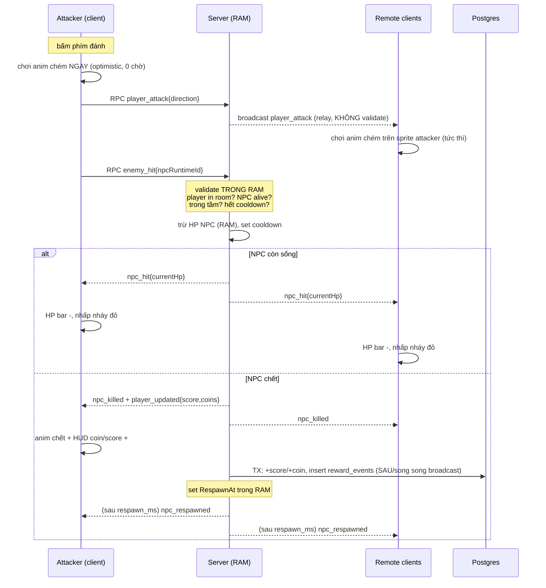

# BigTown — Kế hoạch Phase 2 (v2)

**Sắp xếp lại ưu tiên + quyết định kỹ thuật chi tiết.** Mọi tham chiếu file/hàm/cột bên dưới đều theo code & schema hiện tại trên `main`.

> Đặt tại `docs/Phase-2-Roadmap.md`. So với v1: **đảo P2 lên trước P1** (làm content/editor trước, combat sau), **cấp sẵn coin** để editor chạy được trước khi có combat, viết lại **fade layer dạng vòng tròn + làm mờ cả nhân vật**, **nhạc lưu DB** kèm hướng dẫn setup, và **đặc tả combat chi tiết + sequence diagram**.

---

## Tổng quan ưu tiên (đã đảo thứ tự)

| # | Hạng mục | Tier | Effort | Ghi chú |
|---|---|---|---|---|
| 1 | Enter để focus chatbox | P0 | Thấp | Fix UX Phaser ↔ Vue |
| 2 | Loading indicator + tối ưu init | P0 | Thấp–TB | Ưu tiên loading UI (an toàn), init tối ưu là bonus |
| 3 | Nhạc theo map (lưu DB) | P0 | Thấp | Bỏ hardcode path |
| 4 | **Fade layer dạng vòng tròn + mờ nhân vật** | P0 | TB | Sửa lại behavior hiện tại cho chân thật |
| ★ | **Cấp sẵn coin (balance)** | P0 | Thấp | Làm ngay để editor #6 dùng được trước combat |
| 5 | Animation cho map | **P1** | TB | Workflow Tiled + embed tool |
| 6 | Kéo thả asset custom map + tốn tiền | **P1** | Cao | Dùng coin cấp sẵn ở ★ |
| 7 | Combat enemy + farm coin/điểm | **P2** | Cao | Đặc tả chi tiết + sequence bên dưới |
| 8 | NPC con vật (flavor) | P2 | TB | Dùng chung hạ tầng render NPC của #7 |
| 9 | Perf test 100 VU | P3 | TB | Dùng lại `centrifuge-js` |
| 10 | CICD GitHub Actions | P3 | TB | Chưa có `.github/` |
| ★★ | Tối ưu hiệu suất (cross-cutting) | — | — | Mục cuối |

**Lý do đảo:** editor kéo-thả (#6) là thứ demo được ngay và không phụ thuộc realtime. Chỉ cần **coin có sẵn** là mua/đặt asset chạy được, không cần đợi combat. Combat (#7) phức tạp hơn (RAM state + đồng bộ + reward TX) nên đẩy xuống P2, nhưng **balance coin được set sẵn từ bây giờ** để sau này farm quái chỉ là *cộng thêm*, không phải dựng lại từ đầu.

---

## ★ Cấp sẵn coin (làm trước editor)

**Mục tiêu:** mỗi nhân vật có sẵn một lượng coin lớn để test/chơi editor ngay; khi combat (#7) xong thì farm quái chỉ *cộng thêm* vào cùng cột `characters.coins`.

**Hiện trạng (theo schema & code):**
- `characters.coins INTEGER NOT NULL DEFAULT 0 CHECK (coins >= 0)` — mặc định 0, có ràng buộc **không âm**.
- Hàm tạo nhân vật `insertDefaultCharacterQuery` (trong `character/repository/character_repository.go`) hiện là:
  ```sql
  INSERT INTO characters (user_id, name, base_asset_key, map_id)
  VALUES ($1, $2, $3, $4)
  ```
  → không set `coins` nên rơi về default 0.

**Cách thực hiện (2 việc, đúng pattern config sẵn có):**

1. **Nhân vật mới** — thêm config `GAME_STARTING_COINS` (giống hệt cách `GAME_DEFAULT_MAP_CODE` được inject vào `CharacterRepository.defaultMapCode`). Sửa INSERT:
   ```sql
   INSERT INTO characters (user_id, name, base_asset_key, map_id, coins)
   VALUES ($1, $2, $3, $4, $5)   -- $5 = startingCoins (ví dụ 5000)
   ```
   Wire: thêm field `startingCoins int` vào `CharacterRepository`, đọc từ `config.go` (`GAME_STARTING_COINS`, default 5000), truyền vào `NewCharacterRepository` ở `provider.go`.

2. **Nhân vật đã tồn tại** (trên DB Render đang chạy) — chạy một câu update một lần:
   ```sql
   UPDATE characters SET coins = 5000 WHERE coins < 5000;
   ```

**Lưu ý:**
- Ràng buộc `CHECK (coins >= 0)` là *lưới an toàn*: transaction mua/đặt asset (#6) **phải** kiểm tra `coins >= price` trước khi trừ; nếu lỡ trừ quá tay, Postgres sẽ reject và transaction rollback — không bao giờ để coin âm.
- Khi combat xong, có thể **hạ `GAME_STARTING_COINS` xuống thấp** (vd 100) để coin chủ yếu đến từ farm quái — không cần đổi code, chỉ đổi env.
- Đây là *balance tạm*: ghi rõ trong `reward_events` là `event_type='seed_grant'` nếu muốn truy vết (tùy chọn).

---

## P0 — Quick UX wins

### 1. Enter để focus chatbox (không di chuyển khi gõ)

**Vấn đề:** `GameScene.create()` đăng ký WASD/mũi tên qua `keyboard.addKey(...)`, `update()` đọc `isDown` mỗi frame bất kể ô chat có focus hay không → gõ chat vẫn chạy nhân vật, Phaser còn `preventDefault` nuốt ký tự.

**Cách thực hiện:**
- Dùng đúng pattern cầu nối Phaser↔Vue đã có (`window.dispatchEvent(new CustomEvent('game:switchMap'...))`). Thêm event `game:chatFocus { focused: boolean }`.
- `ChatPanel.vue`: `@focus`/`@blur` ô `draft` → dispatch event. Listener Enter ở `GameView`/Phaser: game mode + Enter → mở panel (đã có `toggleCollapsed()`) + focus input; đang focus có text → gửi; Escape/Enter rỗng → blur.
- `GameScene`: giữ `chatFocused`, nghe `game:chatFocus` (gỡ ở `SHUTDOWN` như `switchMapHandler`). Khi focus → `this.input.keyboard!.enabled = false` (bật lại khi blur): vừa chặn di chuyển, vừa nhả ký tự WASD cho input DOM.
- `update()`: khi `chatFocused`, gọi `localPlayer.update(time, EMPTY_CURSORS)` để về idle + `flushMovementThrottle` gửi `moving:false` cuối → remote thấy mình dừng.

**Flow:**
```
[game] Enter → game:chatFocus{true} → keyboard.enabled=false + ép idle → focus input
gõ (WASD vào input) → Enter (có text) gửi → Escape/Enter rỗng → blur → game:chatFocus{false} → keyboard.enabled=true
```

**Lưu ý:** thiết kế bằng *cờ* `chatFocused` đọc trong từng system, đừng tắt cứng keyboard toàn cục — để sau này hotkey combat (#7) không bị vô hiệu nhầm.

---

### 2. Loading indicator + tối ưu init

**Chiến lược (theo yêu cầu):** ưu tiên **thêm loading indicator** vì nó cải thiện trải nghiệm *chắc chắn*, bất kể tối ưu init có thành công hay không. Tối ưu init (mount không chặn) là *bonus*: thử trước, nếu vướng guard/session thì bỏ, giữ loading UI làm phương án chính.

**Vấn đề:**
- `main.ts` `await authStore.tryRestoreSession()` **trước** `app.mount()` → trắng trang 3–4s (nặng hơn khi Render cold start).
- `PreloadScene.preload()` tải tilemap + tileset + spritesheet mọi class **không có UI tiến trình**; `createGame.ts` để nền `#808080`.

**a) Loading indicator (phương án chính — làm chắc):**
- Giữ nguyên tắc "Vue lo overlay" → overlay loading trong `GameCanvas.vue` (dùng được font VT323).
- `PreloadScene.preload()`: `this.load.on('progress', v => window.dispatchEvent(new CustomEvent('game:loadProgress',{detail:{value:v}})))`. `GameScene.create()` xong → dispatch `game:ready`.
- `GameCanvas.vue` nghe 2 event → hiện thanh %/chữ "Đang tải tài nguyên…", ẩn khi ready.

**b) Tối ưu init (bonus — thử, không được thì thôi):**
- `main.ts`: `app.mount()` ngay, đưa `tryRestoreSession()` vào cờ reactive `restoring`; router guard chờ `sessionReady` promise trước khi quyết định redirect; `App.vue` show splash khi `restoring`.
- **Nếu** việc này gây phức tạp guard (reload route protected bị đá `/login` — chính lý do `main.ts` hiện chặn mount) → **bỏ**, chỉ giữ loading UI ở (a).

**c) Cold start Render (ops):** thêm `/healthz` + keep-alive ping ~10 phút, hoặc plan always-on. Đây là nghi phạm chính của 3–4s đầu.

**Lưu ý:** đo bằng reload 2 lần liên tiếp — lần 2 nhanh hẳn ⇒ cold start là thủ phạm, xử lý ops trước khi tối ưu asset.

---

### 3. Nhạc theo map (bỏ hardcode, lưu DB)

**Vấn đề:** nhạc đang hardcode path trong asset ở code frontend.

**Cách thực hiện — đưa nhạc thành dữ liệu của map trong DB:**

*Backend:*
1. **Schema** — thêm cột vào bảng `maps`:
   ```sql
   -- trong schema.sql, thêm vào CREATE TABLE maps:
   music_asset_key VARCHAR(255)
   ```
2. **SELECT map** — `mapColumns` trong `character_repository.go` phải thêm cột (dùng `COALESCE` để null-safe như các cột khác):
   ```
   ..., COALESCE(music_asset_key, '')
   ```
   và map vào entity `Map` + interface `MapReader` (`realtime/port/map_reader.go`).
3. **Bootstrap DTO** — thêm `MusicAssetKey string json:"music_asset_key"` vào `realtime/delivery/dto.go`, cho `RealtimeUsecase.GetBootstrap` trả về.

*Frontend:*
4. `BootstrapDto` (`realtime.service.ts`) thêm `music_asset_key`. `GameScene.create()`:
   ```ts
   if (bootstrap.music_asset_key) playMusic('/assets/' + bootstrap.music_asset_key)
   ```
   `audio.service.playMusic` đã crossfade sẵn → đổi map (restart scene) tự đổi nhạc.

**⚠️ Ghi chú setup DB (quan trọng — dự án không có migration tool):**
`schema.sql` là **create-only**, chỉ chạy khi DB mới (docker-compose auto-migrate lần đầu). DB đang chạy trên Render sẽ **không tự có** cột mới. Phải chạy thủ công:
```sql
-- 1) Thêm cột (DB đang tồn tại)
ALTER TABLE maps ADD COLUMN IF NOT EXISTS music_asset_key VARCHAR(255);

-- 2) Gán nhạc cho từng map
UPDATE maps SET music_asset_key = 'sounds/village_bgm.mp3'  WHERE code = 'village_adventure';
UPDATE maps SET music_asset_key = 'sounds/winter_bgm.mp3'   WHERE code = 'winter';
UPDATE maps SET music_asset_key = 'sounds/dark_bgm.mp3'     WHERE code = 'dark_village';
```
Đồng thời cập nhật **cả** `schema.sql` (cho DB tương lai) **và** thêm dòng `UPDATE ... SET music_asset_key` vào `seed.sql` (seed idempotent). Đặt file nhạc tương ứng vào `frontend/public/assets/sounds/`.

**Lưu ý:** nhạc chỉ phát sau tương tác đầu (browser chặn autoplay) — `audio.service` xử lý sẵn qua `bindUnlockListener`; tôn trọng `musicMuted/musicVolume` của `AudioSettingsPanel`.

---

### 4. Fade layer dạng vòng tròn + làm mờ cả nhân vật

**Vấn đề với behavior hiện tại:** `aboveLayerFadeSystem.ts` mờ **từng tile** `DecorationAbove` trùng bounding-box player → cảm giác vuông vức, không tự nhiên, và **nhân vật không mờ** nên vẫn thấy "cấn". Mong muốn: một **vùng tròn mềm** (spotlight) làm trong suốt phần layer đang che — đủ to để lộ hết vật thể đang đi vào, nhưng nếu vật quá to thì giới hạn thành vòng tròn nhỏ tự nhiên quanh nhân vật; **và nhân vật cũng mờ đi** cho chân thật.

**Cách thực hiện — chuyển từ "mờ theo tile" sang "mặt nạ tròn mềm" (BitmapMask):**

*Ý tưởng:* thay vì tween alpha từng tile, dùng một **radial-gradient sprite** (tròn, tâm đặc → rìa trong suốt) bám theo nhân vật, làm **inverted mask** cho `aboveLayer`. Ở đâu gradient đặc thì layer bị "khoét" trong suốt (mềm ở rìa), ngoài vòng tròn giữ nguyên.

```ts
// tạo 1 lần: texture gradient tròn mềm (vd 128px), tâm alpha=1 → rìa alpha=0
// dùng Graphics.fillGradientStyle hoặc vẽ radialGradient lên canvas rồi addImage
const maskImg = scene.add.image(0, 0, 'softCircle').setVisible(false)
const mask = maskImg.createBitmapMask()
mask.invertAlpha = true              // khoét thủng thay vì giữ lại
aboveLayer.setMask(mask)

// mỗi frame (hoặc khi di chuyển): maskImg.setPosition(player.x, player.y)
// bán kính = scale của maskImg; cap lại nếu muốn "nhỏ quanh nhân vật"
```

- **"Đủ to để che hết vật / nếu to quá thì nhỏ quanh nhân vật":** chỉnh `maskImg.setScale(...)` để bán kính đủ phủ canopy trung bình; đặt trần bán kính (vd ≤ 64px) để vật quá to vẫn chỉ lộ vòng tròn tự nhiên quanh nhân vật, không "bóc" cả mảng lớn.
- **Rìa mềm:** gradient alpha giảm dần ở rìa → chuyển tiếp mượt, không thấy mép cứng.

*Làm mờ luôn nhân vật:* tái dùng phần phát hiện overlap sẵn có (player có đang đứng dưới tile `DecorationAbove` không) để bật/tắt alpha sprite:
```ts
const under = aboveLayer.getTilesWithinWorldXY(...).some(t => t && t.index > 0)
localPlayer.sprite.setAlpha(under ? 0.72 : 1)   // tween cho mượt
```

**Flow:**
```
mỗi frame:
  maskImg bám theo player (vòng tròn mềm khoét aboveLayer quanh player)
  nếu player đứng dưới tile above → sprite.alpha ~0.72, ngược lại 1 (tween)
```

**Lưu ý:**
- `BitmapMask` áp cho **cả layer** — bán kính/độ mềm điều khiển bằng texture gradient + scale, không phải per-tile. Đây là cách cho "chân thật nhất".
- Nếu muốn tránh mask (một số cấu hình WebGL kén), **fallback**: giữ per-tile nhưng tính alpha **theo khoảng cách tới tâm player trong bán kính R** (tile gần tâm mờ nhiều ~0.2, tile ở rìa R mờ ít ~1) → ra cảm giác tròn/gradient mà vẫn tile-based. Kém mượt hơn mask nhưng đơn giản.
- Hiệu suất: cập nhật mask/alpha mỗi frame ổn cho 1 nhân vật; nếu cần, chỉ update khi player di chuyển (xem mục Tối ưu).

---

## P1 — Content & tooling (đưa lên trước)

### 5. Animation cho map + cách tự làm

**a) Animated tiles** (nước, đuốc, cây lay): định nghĩa trong **Tiled** (Tile Animation Editor: thêm frame + duration). Phaser 4 tự render animated tile qua `map.createLayer` (chỗ `mapSystem.buildMap` đang tạo layer).
- **Mấu chốt dự án này:** `asset/tools/embed_tilesets.js` inline tileset external vào `.tmj` (Phaser không đọc external tileset). **Phải đảm bảo script giữ nguyên mảng `animation` của tile khi embed** — nếu đang lược bỏ, cập nhật script copy đủ field `animation`.

**b) Animated object/sprite** (cờ bay): spawn sprite + `anims` trong system riêng.

**Quy trình "tự làm animation cho map" (ghi vào docs):**
```
1. Mở map trong Tiled
2. Chọn tileset → tile → Tile Animation Editor → thêm frame + duration
3. Export .tmj (giữ external tileset ref)
4. node asset/tools/embed_tilesets.js   # embed, giữ animation, ghi bản public
5. Phaser tự phát animated tile khi createLayer — không cần code thêm
```

**Lưu ý:** nếu Phaser 4 không tự phát → fallback: system hoán đổi `tile.index` theo timer. Chú ý đoạn chỉnh `tile.pixelY` cho tile cao trong `mapSystem.buildMap` — animated tile phải cùng kích thước.

---

### 6. Kéo thả asset để custom map (+ tốn tiền)

Sub-project frontend lớn, làm **theo phase**. Dùng **coin cấp sẵn ở mục ★** nên chạy được ngay, không đợi combat.

**Kiến trúc:**
- View mới `features/game/editor/`: palette (Vue overlay) + canvas Phaser đặt asset. Palette lấy từ bảng `items` (type decoration, có `price`, `asset_key` — đã có sẵn cột).
- **Kéo thả:** HTML5 drag-drop từ palette → thả lên canvas → `camera.getWorldPoint` đổi tọa độ → snap grid (`TILE_SIZE` trong `mapSystem.ts`).
- **Lưu trữ:** bảng mới `map_placements (id, character_id, map_id, item_id, x, y, created_at)`.
- **Tốn tiền:** `POST /api/editor/place { item_id, x, y }` → **transaction** (pattern `ARCHITECTURE_GUIDE.md` mục 6, copy từ `auth/register.go`):
  ```
  kiểm tra characters.coins >= items.price
  → trừ coins (CHECK>=0 là lưới an toàn)
  → insert map_placements
  → insert reward_events(event_type='decoration_place', coin_delta = -price)
  → trả coins mới
  ```

**Phase hoá (giảm rủi ro):**
- **6a — cá nhân, không realtime:** placement của riêng người chơi, render đè cho riêng họ. Không broadcast → không griefing, không lo sync. Ship trước.
- **6b — chia sẻ/realtime (tùy chọn):** broadcast `decoration_placed` qua Centrifuge; cần policy chống phá hoại.

**Flow (6a):**
```
mở editor → palette (item coin đủ mới kéo được)
kéo → thả → snap grid → preview → xác nhận
POST /api/editor/place → TX trừ coin + lưu placement → trả coin mới
client: cập nhật HUD coin + render decoration
```

**Lưu ý:** seed `items` decoration + giá; chốt policy gỡ/refund trước khi code; **không tin giá/coin từ client** — server đọc `items.price`, `characters.coins`.

---

## P2 — Combat & NPC

### 7. Combat enemy + farm coin/điểm — ĐẶC TẢ KỸ THUẬT CHI TIẾT

Đây là phần bạn lo về **độ trễ**. Schema đã đủ (`npc_types`, `map_npc_spawns`, `reward_events`, `characters.coins/score`), `RoomNPC`/`AttackCooldownUntil` đã được thiết kế sẵn trong `Storage-Design.md` mục 5.3–5.4.

#### 7.1 Vấn đề độ trễ & quyết định kiến trúc

**Lo ngại của bạn:** "request tới server phải validate rồi mới bắn lên Centrifuge → có thể trễ; đồng bộ remote player thế nào cho đỡ lag; chỉ thao tác RAM được không?"

**Quyết định: kiến trúc 2 tầng — y hệt cách movement đang chạy (optimistic + authoritative).** Tách phần *cảm giác tức thì* khỏi phần *sự thật*:

**Tầng A — Cosmetic, tức thì (0 chờ server):**
- Người đánh: bấm phím → **chơi animation chém NGAY** trên máy mình (optimistic), không đợi server. Giống hệt local player render movement ngay.
- Đồng thời relay một event nhẹ `player_attack { characterId, direction }` — server **chỉ chuyển tiếp**, *không validate* (như relay `player_move`). Remote clients nhận → chơi animation chém trên sprite người đánh **ngay**. Nhờ vậy cú vung tay hiện tức thì trên mọi máy, không chờ tính damage.

**Tầng B — Authoritative, chỉ trên RAM (không DB trên hot-path):**
- `enemy_hit { npcRuntimeId }` → server validate **hoàn toàn trong RAM**: player có trong room? NPC còn sống? trong tầm? hết cooldown? → trừ HP NPC trong RAM. **Không đụng DB.**
- Vì validate chỉ là so sánh vài số trong RAM (≈ micro-giây), **độ trễ cảm nhận = đúng 1 RTT mạng** — bằng y hệt broadcast movement mà bạn đang thấy mượt. Không có thêm độ trễ từ DB.
- Kết quả broadcast: `npc_hit { npcRuntimeId, currentHp }` (còn sống) hoặc `npc_killed` + `player_updated { score, coins }` (chết).

**"Chỉ RAM được không?" — Được, gần như toàn bộ:**
- HP hiện tại của NPC, alive/dead, cooldown, respawn timer, AI: **RAM 100%** (`Storage-Design.md` 5.3–5.4).
- **DB chỉ chạm khi NPC CHẾT** để lưu bền `score/coin` (không được mất khi restart). Và ngay cả lúc đó: **broadcast kết quả từ RAM TRƯỚC/song song**, rồi mới ghi DB trong transaction — nên feedback trên màn hình *không* phải chờ DB. Chết là sự kiện hiếm (không phải mỗi hit) nên 1 transaction/lần chết là chấp nhận được.

Tóm lại: **mỗi hit = thuần RAM + 1 RTT** (không DB); **DB chỉ vào lúc chết**, và không nằm trên đường feedback.

#### 7.2 Vì sao không để client tự tính damage?

Không thể tin client nói "tôi giết nó" hay "trừ 50 HP" (gian lận điểm/coin — `Storage-Design.md` mục 11). Nên: **cú vung tay** là cosmetic (client tự chơi), nhưng **damage/HP/chết/thưởng** luôn do server RAM quyết. Client optimistic phần *hình*, không optimistic phần *số*: HP bar chỉ update khi `npc_hit` về (1 RTT). Nếu muốn mượt hơn nữa có thể nhấp nháy đỏ NPC ngay khi bấm (predict "trúng") rồi correct theo `npc_hit` — nhưng khuyến nghị giữ đơn giản: swing tức thì + HP theo server.

#### 7.3 Events

```
Client → Server (RPC):
  enemy_hit    { npcRuntimeId }              # authoritative, validate RAM
  player_attack{ direction }                 # cosmetic, server chỉ relay (tùy chọn tách riêng)

Server → Room (broadcast):
  player_attack{ characterId, direction }    # relay tức thì → remote chơi anim chém
  npc_hit      { npcRuntimeId, currentHp }
  npc_killed   { npcRuntimeId, byCharacterId }
  npc_respawned{ npcRuntimeId, x, y, maxHp }
  player_updated{ characterId, score, coins }# cập nhật HUD + leaderboard
  # room_snapshot bổ sung danh sách NPC để người mới join thấy ngay
```

#### 7.4 Backend — điểm chạm code

- `room/state.go`: thêm `RoomNPC` (RuntimeID, SpawnID, NPCTypeID, X, Y, MaxHP, CurrentHP, Alive, RespawnAt) + `NPCs map[string]*RoomNPC` trong `GameRoom`; thêm `AttackCooldownUntil time.Time` vào `RoomPlayer` (đã có sẵn ghi chú "phase sau").
- Port mới `NPCReader` (giống `MapReader`): đọc `map_npc_spawns` join `npc_types` **1 lần khi room khởi tạo** → dựng `RoomNPC` trong RAM. Bind ở `provider.go`.
- `transport/centrifuge.go`: thêm case `enemy_hit` (và `player_attack` relay) vào `client.OnRPC` — resolve character từ `client.UserID()`, **không nhận characterId từ client** (như `player_move`).
- `RoomUsecase.HitEnemy`: validate RAM → trừ HP. Nếu chết: `db.BeginTx` + `*WithTx` cộng `characters.score/coins` + insert `reward_events(event_type='kill_npc')`; set `RespawnAt`. Broadcast (từ RAM) trước khi/independent với ghi DB.
- Respawn: **1 ticker global** quét `RespawnAt` (không goroutine/NPC) → hồi sinh → `npc_respawned`. Dùng chung mutex `MemoryRoomStore`; **không gọi DB khi đang giữ lock**.

#### 7.5 Frontend — render

- System mới `systems/enemyManager.ts` (thêm system, không sửa system cũ):
  - `room_snapshot`/`npc_spawned` → tạo sprite NPC + **HP bar** (container/graphics phía trên).
  - `npc_hit` → nhấp nháy đỏ + tween HP bar về `currentHp/maxHp`; (tùy chọn) **damage number** bay lên.
  - `npc_killed` → animation chết + fade → remove; đợi `npc_respawned` để tạo lại.
  - `npc_respawned` → tạo lại sprite tại vị trí spawn.
- Người đánh (local): phím đánh (vd J/Space) → tìm NPC gần nhất trong tầm → **chơi anim chém ngay** (frame hàng 6–9 `Player.png` theo `Movement-Chat-Spawn-Plan.md` mục D) + gửi `enemy_hit` (+ relay `player_attack`).
- Remote: nhận `player_attack` → chơi anim chém trên sprite tương ứng (qua `RemotePlayerManager`).
- `player_updated` → cập nhật `game.store` coins/score → HUD coin + refresh `LeaderboardPanel`.

#### 7.6 Sequence diagram



**ASCII (nếu viewer không render mermaid):**
```
Attacker            Server(RAM)              Remote           DB
  |-- bấm đánh                                 
  |== anim chém NGAY (optimistic) ==
  |-- player_attack -->|                      
  |                    |== relay player_attack ==>|== anim chém ==
  |-- enemy_hit ------>|
  |                    | validate RAM (in room/alive/range/cooldown)
  |                    | trừ HP NPC (RAM)
  |   [còn sống]  <----|-- npc_hit{hp} ----------->|  (HP bar -, flash)
  |   [chết]      <----|-- npc_killed + player_updated -->|
  |                    |----------------------------------- TX +score/+coin -->|
  |                    | set RespawnAt (RAM)
  |   <----------------|-- npc_respawned (sau respawn_ms) ->|
```

**Kết luận cho lo ngại độ trễ:** vung tay = **0ms** (optimistic, cả local lẫn remote qua relay); HP/kết quả = **1 RTT** (validate RAM ≈ 0, không DB); DB **chỉ** khi chết và **không** chặn feedback. Đây chính là mô hình movement đang chạy mượt, áp cho combat.

**Lưu ý phạm vi:** cut đầu tiên nên là **enemy không đánh trả** (chưa có player death) để ship nhanh — `Storage-Design.md` 5.2 cho phép HP player để RAM, hệ thống chết/hồi sinh làm sau. Cần seed `npc_types` + `map_npc_spawns`.

---

### 8. NPC con vật (flavor)

Layer `NPCSpawns` trong `.tmj` (cừu/gà/bò…) hiện cố tình không render (comment `GameScene.create()`).
- Copy spritesheet từ `asset/Animals/` sang `frontend/public/assets/`.
- System `systems/ambientNpcSystem.ts` (tách khỏi `enemyManager`): đọc `map.getObjectLayer('NPCSpawns')` (như `buildWarpZones`) → spawn sprite idle. **Client-only, không sync, không combat, không coin.**
- **Lưu ý:** nếu cho đi lảng vảng thì mỗi client thấy vị trí khác nhau — chấp nhận vì flavor; muốn tránh nhầm thì để đứng yên + idle.

---

## P3 — Chất lượng & vận hành

### 9. Perf test 100 VU

- **Công cụ:** harness Node dùng chính `centrifuge-js` (đã là dep, khớp wire format FE thật — đội đã từng test WS bằng Node). 100 client: connect, subscribe room, publish `player_move` ~10Hz, chat định kỳ.
- **Assertion "đủ tin nhắn":** mỗi chat broadcast phải tới đủ 100/100 client; đo p50/p95 latency, message loss, connect success. Thu CPU/RAM backend + tải Postgres (hot-path RAM nên ~0).
- **Lưu ý:** điểm nghẽn thật là **fan-out** (~100×100×10 ≈ 100k msg/s) chứ không phải RTT — đây là bài test ngưỡng 1-node (`Architecture.md` mục 10). Render free-tier sẽ nghẽn → test trên plan trả phí/local. Nếu nghẽn: giảm tick rate động, gộp 2 connection→1, bật protobuf, hoặc Redis broker + room sharding.

### 10. CICD GitHub Actions (chưa có `.github/`)

- `backend-ci.yml`: Go 1.26 → `go build ./...`, `go vet ./...`, check `gofmt -l .`, `go test ./...` (+ golangci-lint tùy chọn).
- `frontend-ci.yml`: Node → `npm ci` → `vue-tsc -b` → `npm run build`.
- `e2e-ws.yml`: Postgres service container (chạy `schema.sql`+`seed.sql`) → chạy backend → harness WS Node (5–10 client) verify join/move/chat/correction.
- **Deploy:** Vercel auto-deploy FE sẵn; thêm bước gọi Render deploy hook sau khi CI pass trên `main`. Secrets qua GitHub Actions secrets.

---

## ★★ Tối ưu hiệu suất (cross-cutting)

**Backend:**
- Giữ hot-path RAM (đã đạt với `MovePlayer`); combat cũng RAM-only, DB chỉ khi NPC chết.
- Scale: server-side batching/coalescing khi tải cao, gửi delta, giảm tick rate động.
- Bật **protobuf** Centrifuge (nhẹ hơn JSON).
- **Gộp 2 connection/user → 1** (ChatPanel + GameScene) qua `game.store` — giảm nửa connection.
- Respawn/AI: **1 ticker global**, tránh bùng nổ goroutine.
- `reward_events` đã có index `character_id`; `chat_messages` đã có index `(room_id, created_at DESC)`.

**Frontend:**
- Loading indicator (#2) + (nếu được) mount không chặn.
- Nén asset: pngquant tileset, **atlas** hoá tileset (giảm HTTP request + draw call), encode audio bitrate thấp.
- **Object pooling** sprite remote/chat bubble/damage number (quan trọng khi 100 người).
- Fade layer/mask: cập nhật mask & `getTilesWithinWorldXY` **chỉ khi player di chuyển** hoặc mỗi 2–3 frame, thay vì mỗi frame.
- Remote tween: theo dõi `killTweensOf` khi đông; cân nhắc reuse tween.

**Network / hạ tầng:**
- gzip/brotli ở Nginx cho static + JSON.
- CDN cho `/assets` (Vercel đã CDN FE static).
- Render always-on / keep-alive ping trị cold start.
- Nhiều node: **Redis broker** cho Centrifuge (`Architecture.md` mục 10).

---

## Thứ tự & phụ thuộc (tóm tắt)

```
P0:  ★ Cấp coin  →  1 Enter-chat  →  2 Loading  →  3 Music(DB)  →  4 Fade tròn+mờ nhân vật
P1:  5 Map animation  →  6 Editor kéo-thả (dùng coin ★)
P2:  7 Combat (farm coin, cộng thêm vào cột coins)  →  8 NPC con vật
P3:  9 Perf 100 VU        |        10 CICD (dựng sớm, chạy song song)
★★  Tối ưu hiệu suất: rải xuyên suốt
```

**Nguyên tắc bất biến:** server-authoritative tuyệt đối cho *số* (damage/coin/score), optimistic cho *hình* (anim); hot-path realtime không chạm DB; mỗi tính năng mới = thêm 1 system/module riêng, không phình file lõi.
